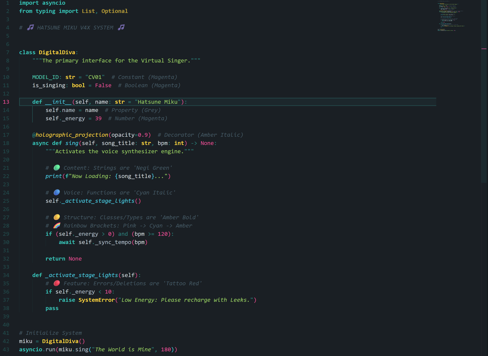

# Hatsune Miku Theme (All-Miku Synthesis Edition)

> "The World is My Stage, and Code is My Song."

A high-fidelity Visual Studio Code theme optimized for marathon coding sessions, deeply integrated with the aesthetics of **every Hatsune Miku version** - from V2 Classic (2007) to Project SEKAI (2020).

## Design Philosophy: All-Miku Synthesis

This theme treats your IDE as a **Virtual Stage**, mapping each Miku version to specific UI roles. The canonical identity color `#39C5BB` remains THE foundation, while other versions provide interaction states and visual depth.

### Version-to-UI Mapping

| Version | Color | UI Role | Reasoning |
| :--- | :--- | :--- | :--- |
| **V2 Classic** | `#39C5BB` | **Identity** - Keywords, Borders | THE canonical Miku teal since 2007 |
| **SEKAI** | `#33CCBB` | **Stage** - Secondary cursors | Project SEKAI stage presence |
| **NT** | `#00BCD4` | **Voice** - Functions | Modern, technological voice |
| **Append Light** | `#B2EBE7` | **Structure** - Types, Classes | Airy, ice-like structure |
| **Append Sweet** | `#5FCEC8` | **Hover** - Hover states | Warm, inviting interaction |
| **V4X Soft** | `#6DD4CD` | **Focus** - Focus states | Gentle attention |
| **V4X Hard** | `#2B9E96` | **Active** - Pressed states | Grounded, pressed feel |
| **Append Vivid** | `#00E5D4` | **Electric** - Active line, glow | Electric, peak highlights |

### Semantic Color Hierarchy

| Concept | Element | Color | Meaning |
| :--- | :--- | :--- | :--- |
| **The Identity** | Hair / Tie | `#39C5BB` (V2 Teal) | **Keywords** - The core structure |
| **The Voice** | Eyes | `#00BCD4` (NT Cyan) | **Functions** - The melodic action |
| **The Structure** | Hair Highlights | `#B2EBE7` (Ice Teal) | **Types & Classes** - The architecture |
| **The Rhythm** | Ribbons / LEDs | `#E05096` (Magenta) | **Constants & Numbers** - The beat |
| **The Content** | Negi (Leek) | `#9CCC65` (Green) | **Strings** - The raw data |
| **The Meta** | Stage Lights | `#FFD740` (Amber) | **Decorators & Macros** - Meta-programming |
| **The Stage** | Outfit | `#1A1F24` (Charcoal) | **UI Background** - V4X uniform fabric |
| **The Warning** | "01" Tattoo | `#FF5370` (Red) | **Errors** - High-visibility alerts |

## Key Features

### 1. Frequency Visualizer (Indent Guides)

Indent guides create a **visual audio spectrum** as code nests deeper - from deep bass tones to airy highs:

| Level | Color | Version | Frequency |
| :--- | :--- | :--- | :--- |
| 1 | `#1E8A82` | Append Dark | Bass (deep foundation) |
| 2 | `#2AA69E` | Append Solid | Low (grounded) |
| 3 | `#39C5BB` | V2 Classic | Mid (identity core) |
| 4 | `#3ED1C8` | NT | High (clarity) |
| 5 | `#00E5D4` | Append Vivid | Peak (electric) |
| 6 | `#A8EBE6` | Append Light | Ultra (airy transcendence) |

### 2. Semantic Visual Hierarchy

- **Keywords** are **Bold** (`#39C5BB`) - the skeleton of your code
- **Functions** are distinct (`#00BCD4`) - saturated cyan for action
- **Types** are **Bold Ice** (`#B2EBE7`) - cool, structural emphasis
- **Comments** are faded (`#6E9090`) - reduced visual noise

### 3. Interaction States (V4X/Append Voices)

- **Hover**: Append Sweet `#5FCEC8` - warm, inviting
- **Focus**: V4X Soft `#6DD4CD` - gentle attention
- **Active**: V4X Hard `#2B9E96` - pressed/clicked feedback
- **Electric Glow**: Append Vivid `#00E5D4` - active line numbers, ghost text

### 4. SEKAI Stage Accents

- **Primary Cursor**: `#FF6B9D` (SEKAI Pink)
- **Secondary Cursors**: `#33CCBB` (SEKAI Teal)
- **Find Matches**: `#FF6B9D` (Stage spotlight)
- **Active Borders**: `#FF6B9D` (Performance emphasis)

### 5. Multi-Language Adaptability

- **TypeScript/JSX**: Components (`#B2EBE7`), Functions (`#00BCD4`)
- **Rust**: Lifetimes (Pink), Macros (Amber Bold)
- **Python**: Magic methods (Cyan Bold), Decorators (Amber Italic)
- **Markdown**: H1 (Pink), H2 (Cyan), H3 (Amber), H4 (Teal)
- **CSS/SCSS**: Classes (Teal), IDs (Pink Bold)

## Example Files

The `examples/` folder contains showcase files for Python, TypeScript, Rust, Go, CSS, Vue, Svelte, GraphQL, Markdown, JSON, YAML, SQL, Shell, and HTML.

## Installation

### Manual Installation (.vsix)

1. Download the **`hatsune-miku-theme-x.x.x.vsix`** file.
2. Open VS Code Extensions sidebar (`Ctrl+Shift+X` / `Cmd+Shift+X`).
3. Click the **"..."** (Views and More Actions) menu at the top right corner.
4. Select **"Install from VSIX..."**.
5. Locate and select the `.vsix` file you downloaded.

### Activation

Once installed, a popup should appear asking to set the theme. If not:

- Press `Ctrl+K`, then `Ctrl+T` (or `Cmd+K`, `Cmd+T` on macOS).
- Select **Hatsune Miku Theme** from the list.

---

*All-Miku Synthesis: Every voice, one stage.*
