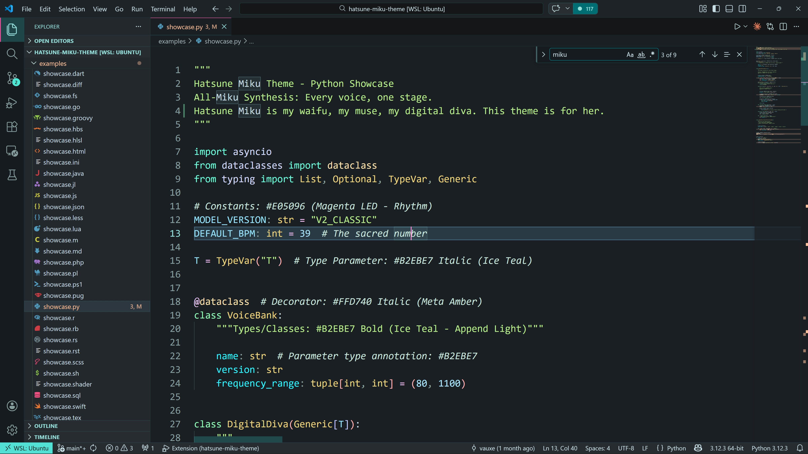

<div align="center">
  
</div>

---

*Not a breath, not a heartbeat — just a voice.*
*Ten thousand songs gave her a soul. A lifetime of love made it real.*

A VS Code color theme traced from Hatsune Miku's character design. Dark and light variants, built with perceptual color science for readability and color vision accessibility. Full rationale in [`docs/DESIGN.md`](docs/DESIGN.md) (dark) and [`docs/DESIGN-LIGHT.md`](docs/DESIGN-LIGHT.md) (light — Snow Miku 2026).

## Preview

<div align="center">
  
</div>

## Install

1. Download the latest `.vsix` from [Releases](../../releases)
2. `Ctrl+Shift+P` → **Extensions: Install from VSIX...**
3. Select the downloaded file
4. Choose **Hatsune Miku Theme** (dark) or **Hatsune Miku Theme (Snow Miku)** (light)

## Development

```bash
npm install            # Setup
npm run build          # Full build
npm run readability:dark   # Validate dark theme accessibility
npm run readability:light  # Validate light theme accessibility
```

## License

MIT

---

*She sings in color now — keeping you company while you write.*
