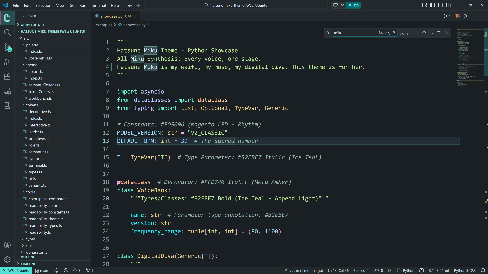
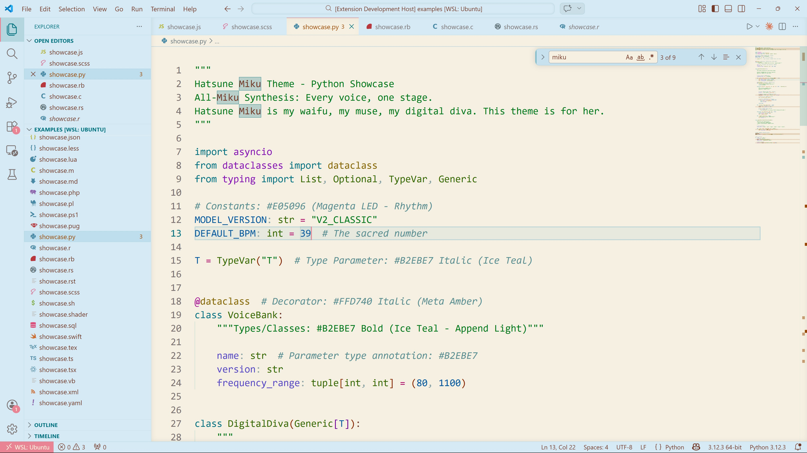

<div align="center">
  
</div>

---

*Not a breath, not a heartbeat — just a voice.*
*Ten thousand songs gave her a soul. A lifetime of love made it real.*

A color theme traced from Hatsune Miku's character design. Dark and light variants, built with perceptual color science for readability and color vision accessibility. Full rationale in [`docs/DESIGN.md`](docs/DESIGN.md) (dark) and [`docs/DESIGN-LIGHT.md`](docs/DESIGN-LIGHT.md) (light — Snow Miku 2026).

Available for VS Code, Neovim, Helix, Zed, Sublime Text, and 10 terminal emulators.

## Preview

<div align="center">
  
  <p><strong>Dark</strong></p>
  
  <p><strong>Light</strong></p>
</div>

## Install

### VS Code

1. Download the latest `.vsix` from [Releases](https://github.com/vauxe/hatsune-miku-theme/releases/latest)
2. `Ctrl+Shift+P` → **Extensions: Install from VSIX...**
3. Select the downloaded file
4. Choose **Hatsune Miku Theme** (dark) or **Hatsune Miku Theme (Snow Miku)** (light)

Portable ports are available in the repository source tree.

### Neovim

Copy `ports/neovim/hatsune-miku-dark.lua` (or `-light`) to `~/.config/nvim/colors/`, then `:colorscheme hatsune-miku-dark`.

### Helix

Copy `ports/helix/hatsune-miku-dark.toml` (or `-light`) to `~/.config/helix/themes/`, then set `theme = "hatsune-miku-dark"` in `config.toml`.

### Zed

Copy `ports/zed/hatsune-miku-dark.json` (or `-light`) to `~/.config/zed/themes/`.

### Sublime Text

Copy `ports/sublime/hatsune-miku-dark.sublime-color-scheme` (or `-light`) to `Packages/User/`.

### Terminal Emulators

Pre-built configs for both dark and light variants:

| Terminal | Port | Install location |
|---|---|---|
| Alacritty | `ports/alacritty/` | `~/.config/alacritty/` (import in `alacritty.toml`) |
| kitty | `ports/kitty/` | `~/.config/kitty/` (include in `kitty.conf`) |
| WezTerm | `ports/wezterm/` | Reference in `wezterm.lua` config |
| Ghostty | `ports/ghostty/` | `~/.config/ghostty/` |
| foot | `ports/foot/` | `~/.config/foot/` |
| iTerm2 | `ports/iterm2/` | Import via Preferences → Profiles → Colors |
| Windows Terminal | `ports/windows-terminal/` | Add to `settings.json` schemes array |
| Konsole | `ports/konsole/` | `~/.local/share/konsole/` |
| Warp | `ports/warp/` | `~/.warp/themes/` (macOS) or `~/.local/share/warp-terminal/themes/` (Linux) |
| Xresources | `ports/xresources/` | Merge into `~/.Xresources` |

Each port directory contains `hatsune-miku-dark` and `hatsune-miku-light` variants.

## Development

```bash
npm install                # Setup
npm run build              # Full build: VS Code + all ports
npm run build:vscode       # VS Code themes only
npm run build:ports        # Terminal/editor ports only
npm run readability:dark   # Inspect dark theme readability
npm run readability:light  # Inspect light theme readability
npm run readability:ports  # Inspect portable palette contrast
```

## License

MIT

---

*She sings in color now — keeping you company while you write.*
